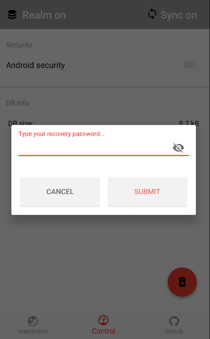
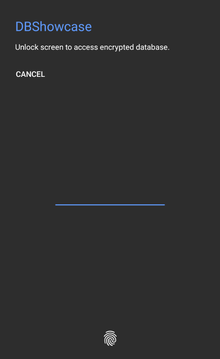

#Android local database showcase

 <a href="https://play.google.com/store/apps/details?id=cz.koto.misak.dbshowcase.android"></a>

```
Unfortunatelly DBShowcase & SecurityShowcase were removed from GooglePlay by google because it violates the deceptive device settings changes policy. 

This is caused by usage BIND_DEVICE_ADMIN for pre-Lollipop Android version.
  
I have been currently working on change of the new version of SecurityShowcase to fulfill device settings:
Developer must explain to users why you are requesting the ‘android.permission.BIND_DEVICE_ADMIN’ in his app. 
Apps must provide accurate disclosure of their functionality and should perform as reasonably expected by the user. 
Any changes to device settings must be made with the user's knowledge and consent and be easily reversible by the user.
  
  
KeystoreCompat will be also written in more component way (user will be able to include API version separatedly).
It means when app support API L+ or API M+ then there is no need to include library with code for API K+
```

| Branch | Status |
| --- | --- |
| master | [](https://circleci.com/gh/kotomisak/db-showcase-android/tree/master) |  
| develop| [](https://circleci.com/gh/kotomisak/db-showcase-android/tree/develop) |


This is sample of local database implementation for small set of Android related local databases.

##Model
Every implemented database is based on the same application model:  

**SCHOOL CLASS** _(can have more students, more teachers)_  
**TEACHER** _(can teach more classes)_  
**STUDENT** _(can be in one class only, can have more teachers)_  

&nbsp; <br/><br/>
&nbsp; <br/>


## Build app
./gradlew assembleRelease

## Dependency diagnostic ##

  `./gradlew dependencyReport --configuration compile`
  `./gradlew dependencyInsighty --configuration compile --dependency com.android.support:appcompat-v7`
  `./gradlew dependencyInsighty --configuration compile --dependency org.jetbrains.kotlin:kotlin-stdlib`

<!--**Couchbase Lite** (http://developer.couchbase.com/mobile/) - a lightweight embedded NoSQL database engine for Android with the built-in ability to sync to Couchbase Server.  
-->
## DBFlow

[DBFlow usage guide](https://agrosner.gitbooks.io/dbflow/content/Usage.html)

## Realm.io
_Engine: TightDB_ <br/>
<a href="https://realm.io/"></a><br/>

Look for my notes from Android meetup:<br/>
[  ](https://www.strv.com/)<br/>
[Android Developer Meetup 11/2016 pdf](./extras/talks/realm.meetup.11-2016.pdf)<br/>
[Android Developer Meetup 11/2016 Google slides](https://docs.google.com/presentation/d/1kT0RNL0JYa1TZ2Vs9Ft34XAIS5ej3DEpecz7RnXXXQ8/edit?usp=sharing)<br/>
[Android Developer Meetup 11/2016 video](https://www.youtube.com/watch?v=NdrVjNNq4hc&t=100s)

### Inspect unencrypted data with Stetho/Chrome
chrome://inspect/#devices

### Inspect encrypted data with adb & Realm browser
adb pull /data/data/cz.koto.misak.dbshowcase.android.debug/files/open.realm
adb pull /data/data/cz.koto.misak.dbshowcase.android.debug/files/default.realm


## Open to implement

- **Paper**
https://github.com/pilgr/Paper
NoSQL object database using efficient Kryoserialization. Class structure handled automatically.

- **ObjectBox**
https://github.com/greenrobot/ObjectBox
NoSQL object database from the team of GreenRobot.

- **DBFlow**
Refactor/Refresh DBFlow implementation & add this feature to app
(https://github.com/Raizlabs/DBFlow/) - fastest ORM on top of SQLLite engine  
_Engine: SQLLite_  


- **Couchbase Lite**
(http://developer.couchbase.com/mobile/) - NoSQL database solution that delivers NoSQL to mobile.   
_Engine: ForestDB_  


