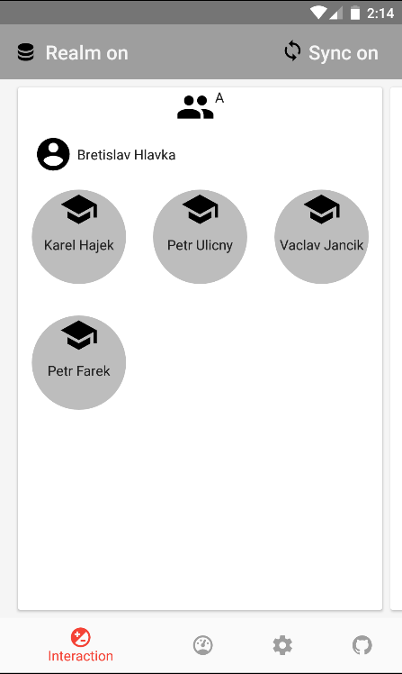

#Android local database showcase

This is sample of local database implementation for small set of Android related local databases.

##Model
Every implemented database is based on the same application model:  

**SCHOOL CLASS** _(can have more students, more teachers)_  
**TEACHER** _(can teach more classes)_  
**STUDENT** _(can be in one class only, can have more teachers)_  

<!--**Couchbase Lite** (http://developer.couchbase.com/mobile/) - a lightweight embedded NoSQL database engine for Android with the built-in ability to sync to Couchbase Server.  
-->
##2. Realm.io
In progress... 
(https://realm.io/) - replacement for SQLLite. 
_Engine: TightDB_

### Inspect data with chrome
chrome://inspect/#devices

##3. SQL Lite - DBFlow
Not finished yet...
(https://github.com/Raizlabs/DBFlow/) - fastest ORM on top of SQLLite engine
_Engine: SQLLite_

<h2>4. Couchbase Lite</h2>
Not even started tet...
(http://developer.couchbase.com/mobile/) - NoSQL database solution that delivers NoSQL to mobile. 
_Engine: ForestDB_

Couchbase Mobile is a NoSQL database solution that delivers NoSQL to mobile. 
It's engineered to provide fast and consistent access to data, 
with or without a network connection, removing network dependency. 
It is comprised of two components:

* Couchbase Lite: An embedded NoSQL database that runs on the device, in your application, with a very small footprint.
* Couchbase Sync Gateway: An internet-facing cloud component that securely synchronizes data between the mobile device and the cloud.

Among the enhancements to the solution is increased security on mobile devices 
by encrypting data at rest on the device using enterprise level 256-bit AES full database encryption. 

